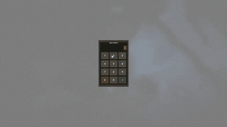

# ServerCodeLock

<p align="center">
  <strong>One-time wipe PIN gate for private Rust servers</strong><br/>
  Oxide · Carbon · MIT
</p>

<p align="center">
  <a href="README.md">English</a> ·
  <a href="README.ru.md">Русский</a>
</p>

<p align="center">
  
  
  
  
  
  
</p>

ServerCodeLock is a server-side join gate for private and wipe-gated Rust communities. Every player who is not on the allow-list must enter a numeric PIN before they can move, loot, build, chat, or fight. Authorization is persisted for the current wipe and cleared automatically when a new save is detected.

It is a community access control layer — not a replacement for Facepunch server passwords, EAC, or your host firewall.

---

## Why it exists

Private servers usually share a PIN in Discord and hope people behave. Without a gate:

- randoms join from the server browser and loot the map before staff notice
- sleepers wake into a live raid with no check
- allow-lists drift across wipes and nobody remembers who was granted

ServerCodeLock makes the contract explicit: **no PIN, no play — once per wipe.**

---

## Features

| Capability | What it does |
|---|---|
| Join keypad | Full-screen CUI keypad on connect, after sleep, and after respawn |
| Wipe-scoped allow-list | `Authorized` + `WipeId` stored in `state.json`; list resets on a new save |
| Grant / revoke | Per-SteamID persistence from console or admin permission |
| Escalating penalties | Wrong PIN → kick after N attempts → ban after M attempts |
| Idle timeout | Auto-kick if the player stares at the keypad too long (`0` disables) |
| Player freeze | Input lock, position snap-back, frozen metabolism, paused fly/speed checks |
| Action lockdown | Blocks damage, targeting, loot, build, craft, pickup, spectate, chat, commands, voice |
| Framework-safe hooks | Full hook set on Oxide; fragile signature hooks compiled out on Carbon |
| Weak-PIN warning | Console warning for `1234`, repeats, sequences, and other trivial codes |
| Bilingual UI | English and Russian strings via config |
| Observability | File logs, buffered flush, verbose debug mode, `scl.status` |

---

## Requirements

- A Rust dedicated server
- [Oxide](https://umod.org/) **or** [Carbon](https://carbonmod.gg/)
- Plugin file `ServerCodeLock.cs` (this repository)

No extra dependencies. No paid packages.

---

## Quick start

```bash
# 1. Drop the plugin in
#    Oxide:  oxide/plugins/ServerCodeLock.cs
#    Carbon: carbon/plugins/ServerCodeLock.cs

# 2. Load it
oxide.reload ServerCodeLock                 # Oxide
carbon.plugin reload ServerCodeLock         # Carbon

# 3. Replace the default PIN immediately
scl.setpass 4829
```

Anyone not already authorized — and not covered by a bypass — sees the keypad on the next spawn.

Updating an already-loaded copy requires a clean unload/load so the host recompiles the source:

```bash
oxide.plugin unload ServerCodeLock && oxide.plugin load ServerCodeLock
carbon.plugin unload ServerCodeLock && carbon.plugin load ServerCodeLock
```

---

## How it works

```
player connects / wakes / respawns
        │
        ▼
bypass?  (admin / moderator / permission / already authorized)
        │ yes                         │ no
        ▼                             ▼
    skip gate                   show CUI keypad
                                freeze input + metabolism
                                snap-back if they move
                                block combat / loot / chat
                                        │
                         correct PIN ───┼─── wrong PIN
                              │         │
                              ▼         ▼
                     add to allow-list  increment attempts
                     persist state.json kick at threshold
                     dismiss UI         ban at threshold
```

### Demo



Wipe identity is derived from the current save (seed, world size, save time). When `WipeId` changes, `Authorized` and `Attempts` are cleared and every player must enter the PIN again.

On **Carbon**, hooks that patch game methods whose signatures change between Rust builds are excluded at compile time (`#if !CARBON`). That avoids `Invalid IL code` / `Signature not found`. The gate still holds the player with input lock, snap-back, blocked chat/commands/voice, and frozen metabolism. On **Oxide** the full hook set is active.

---

## Commands

Admin commands run from the **server console**, or in-game if the caller has `servercodelock.admin`.

| Command | Arguments | Description |
|---|---|---|
| `scl.setpass` | `<digits>` | Set the PIN. Digits only, maximum 8 characters |
| `scl.grant` | `<steamid>` | Add a player to the current-wipe allow-list |
| `scl.revoke` | `<steamid>` | Remove a player from the allow-list |
| `scl.resetauth` | — | Clear every authorization and attempt counter |
| `scl.status` | — | Print PIN length, wipe id, counts, pending sessions |

Players never type the PIN in chat. They use the on-screen keypad:

| Key | Action |
|---|---|
| `0`–`9` | Append a digit (`scl.press`) |
| `C` | Clear the buffer (`scl.clear`) |
| `↵` | Submit (`scl.enter`) |

Input is rate-limited (~120 ms) to stop keypad spam. Wrong submissions play the vanilla code-lock deny / shock effects.

---

## Permissions

| Permission | Effect |
|---|---|
| `servercodelock.bypass` | Skip the gate entirely |
| `servercodelock.admin` | Use `grant`, `revoke`, `setpass`, `resetauth`, `status` |

Staff flags are separate from permissions:

| Config | Default | Effect |
|---|---|---|
| `BypassAdmins` | `true` | Auth-level admins skip the gate |
| `BypassModerators` | `false` | Moderators skip the gate |

The gate is never shown to players already in `Authorized`. That is intentional.

---

## Configuration

Generated on first load as `ServerCodeLock.json`.

| Key in JSON | Default | Description |
|---|---|---|
| `Password` | `1234` | Shared server PIN. Change this before going live |
| `MaxAttemptsBeforeKick` | `3` | Kick after this many wrong submissions |
| `MaxAttemptsBeforeBan` | `10` | Ban after this many wrong submissions |
| `KickReason` | `Wrong password. Too many attempts.` | Kick message |
| `BanReason` | `Too many failed password attempts.` | Ban message |
| `GateTimeoutSeconds (0 = off)` | `180` | Seconds of idle keypad time before kick. `0` disables |
| `GateTimeoutReason` | `Password entry timed out.` | Timeout kick message |
| `BypassAdmins` | `true` | Auth-level admins skip the gate |
| `BypassModerators` | `false` | Moderators skip the gate |
| `BroadcastUnlock` | `false` | Announce a successful unlock to the server |
| `UseBlur` | `true` | Blurred backdrop behind the keypad; otherwise a dark overlay |
| `Language (en/ru)` | `en` | UI language: `en` or `ru` |
| `LogToFile` | `true` | Append events under the framework logs folder |
| `DebugVerbose` | `false` | Extra diagnostics in console / log file |

Two JSON keys include a hint in the property name (`GateTimeoutSeconds (0 = off)` and `Language (en/ru)`). Edit those exact keys — do not rename them.

---

## Data and wipe reset

State lives in `ServerCodeLock/state.json`:

```json
{
  "WipeId": "<derived-from-current-save>",
  "Authorized": [ "7656119…" ],
  "Attempts": { "7656119…": 2 }
}
```

| Framework | Path |
|---|---|
| Oxide | `oxide/data/ServerCodeLock/state.json` |
| Carbon | `carbon/data/ServerCodeLock/state.json` |

Logs (when `LogToFile` is on):

| Framework | Path |
|---|---|
| Oxide | `oxide/logs/ServerCodeLock/` |
| Carbon | `carbon/logs/ServerCodeLock/` (host-dependent; Oxide-style path is also used) |

> **Do not delete a leftover `authorized` file and assume you are done.** Legacy files are migrated into `state.json`. To reset cleanly, run `scl.resetauth` or delete the whole `ServerCodeLock` data folder.

---

## Compatibility

| Surface | Oxide | Carbon |
|---|---|---|
| PIN keypad + allow-list | Yes | Yes |
| Kick / ban / timeout | Yes | Yes |
| Input lock, snap-back, metabolism freeze | Yes | Yes |
| Chat / command / voice block | Yes | Yes |
| Damage, loot, build, target hooks | Yes | Compiled out (signature-safe) |

Tested against current Oxide and Carbon plugin APIs. Rust protocol updates can still break CUI or hook names on either host — file an issue with the exact build and stack trace if that happens.

---

## Security notes

- The PIN is stored **in plaintext** in `ServerCodeLock.json`. Protect the server filesystem the same way you protect RCON.
- Default PIN `1234` prints a weak-PIN warning on load. So do repeats (`0000`, `1111`) and trivial sequences. Change it.
- This plugin cannot hide a server that is listed as public, stop a stolen admin account, or survive a compromised host.
- Attempt counters persist across reconnects for the current wipe, so kicking yourself out and rejoining does not reset the ban ladder.
- `servercodelock.bypass` is powerful. Grant it the same way you grant other staff permissions.

---

## Troubleshooting

**Players freeze or get kicked on join**
The gate is working. Either they need the PIN, `BypassAdmins` should be on for staff, or you should `scl.grant <steamid>`.

**Forgot the PIN**
`scl.setpass <digits>` or edit `Password` in the config and reload.

**Allow-list did not clear after a wipe**
Confirm a new `WipeId` was written to `state.json`. If you copied the data folder onto a fresh map, delete it or run `scl.resetauth`.

**Carbon throws `Invalid IL code` / `Signature not found`**
You are running an old copy that still compiled fragile hooks. Update to this tree — those hooks are excluded on Carbon.

**Keypad does not appear for a specific player**
They are authorized, have `servercodelock.bypass`, or match `BypassAdmins` / `BypassModerators`. Check `scl.status`.

**Need more detail**
Set `DebugVerbose` to `true`, reproduce once, then turn it off. Logs grow quickly.

---

## Project layout

```
ServerCodeLock/
├── ServerCodeLock.cs   # plugin source (drop-in)
├── demo.gif            # UI demo
├── README.md
├── README.ru.md
├── CHANGELOG.md
├── LICENSE             # MIT
└── .gitignore
```

Single-file plugin on purpose: hosts expect `plugins/ServerCodeLock.cs`, not a multi-project solution.

---

## Changelog

See [CHANGELOG.md](CHANGELOG.md) for the 1.3.0 notes.

---

## Contributing

Issues and pull requests are welcome.

1. Keep the plugin a single `.cs` file.
2. Preserve Carbon compile-time hook exclusion.
3. Do not add network calls, telemetry, or paid-API dependencies.
4. Match the existing region layout (`Fields`, `Types`, lifecycle, hooks, UI, commands).

Describe the Rust build, Oxide/Carbon version, and a short repro when you file a bug.

---

## License

[MIT](LICENSE). Use it, modify it, ship it on a paid server, fork it. Attribution is appreciated, not required.

---

## Support

Author: [tzuxi728](https://github.com/tzuxi728) · Telegram: [@tzuxi](https://t.me/tzuxi)

If the plugin saved a wipe night: [@sqd728](https://t.me/sqd728)
