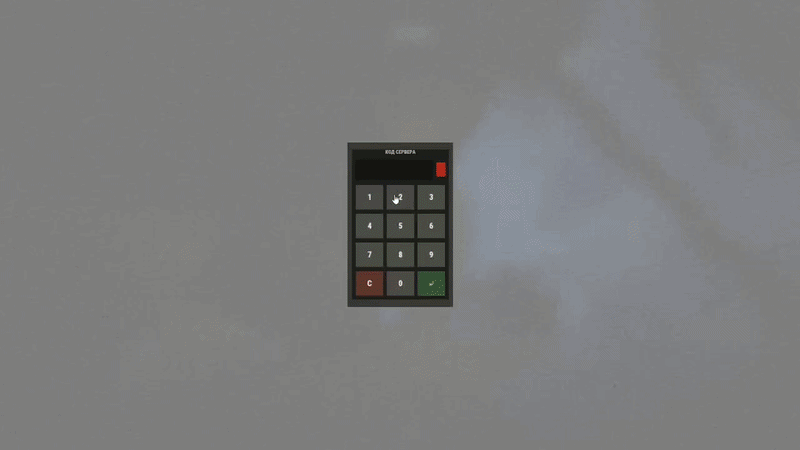

# ServerCodeLock

<p align="center">
  <strong>Разовый PIN-шлюз на вайп для приватных серверов Rust</strong><br/>
  Oxide · Carbon · MIT
</p>

<p align="center">
  <a href="README.md">English</a> ·
  <a href="README.ru.md">Русский</a>
</p>

<p align="center">
  
  
  
  
  
  
</p>

ServerCodeLock — серверный шлюз на вход для приватных и вайп-закрытых сообществ Rust. Каждый игрок вне списка допуска должен ввести числовой PIN, прежде чем сможет двигаться, лутать, строить, писать в чат или участвовать в бою. Допуск сохраняется на текущий вайп и сбрасывается при обнаружении нового сейва.

Это слой доступа сообщества, а не замена пароля сервера Facepunch, EAC или файрвола хостинга.

---

## Зачем это нужно

На приватных серверах PIN обычно кидают в Discord и надеются на порядочность. Без шлюза:

- рандомы заходят из браузера серверов и лутают карту, пока админы не заметили
- слиперы просыпаются посреди рейда без проверки
- список допуска расползается между вайпами, и никто не помнит, кого пускали

ServerCodeLock фиксирует правило явно: **нет PIN — нет игры. Один раз на вайп.**

---

## Возможности

| Возможность | Что делает |
|---|---|
| Клавиатура на входе | Полноэкранный CUI-keypad при коннекте, после сна и после респавна |
| Список допуска на вайп | `Authorized` + `WipeId` в `state.json`; список очищается на новом сейве |
| Grant / revoke | Допуск по SteamID из консоли или по админ-праву |
| Эскалация наказаний | Неверный PIN → кик после N попыток → бан после M попыток |
| Таймаут бездействия | Автокик, если игрок слишком долго смотрит на клавиатуру (`0` выключает) |
| Заморозка игрока | Блок ввода, возврат на точку, замороженный метаболизм, пауза проверок fly/speed |
| Локдаун действий | Блокирует урон, таргет, лут, строительство, крафт, подбор, спект, чат, команды, голос |
| Безопасные хуки | Полный набор на Oxide; хрупкие хуки с сигнатурами вырезаются на Carbon |
| Предупреждение о слабом PIN | В консоль, если код `1234`, повтор цифр или очевидная последовательность |
| Два языка UI | Английский и русский через конфиг |
| Наблюдаемость | Файловые логи, буферный сброс, подробный дебаг, `scl.status` |

---

## Требования

- Выделенный сервер Rust
- [Oxide](https://umod.org/) **или** [Carbon](https://carbonmod.gg/)
- Файл плагина `ServerCodeLock.cs` (этот репозиторий)

Сторонних зависимостей нет. Платных пакетов нет.

---

## Быстрый старт

```bash
# 1. Положите плагин
#    Oxide:  oxide/plugins/ServerCodeLock.cs
#    Carbon: carbon/plugins/ServerCodeLock.cs

# 2. Загрузите
oxide.reload ServerCodeLock                 # Oxide
carbon.plugin reload ServerCodeLock         # Carbon

# 3. Сразу смените дефолтный PIN
scl.setpass 4829
```

Любой, кого ещё нет в допуске и кто не попадает под bypass, увидит клавиатуру на следующем спавне.

При обновлении уже загруженного плагина нужна чистая перезагрузка, чтобы хост перекомпилировал исходник:

```bash
oxide.plugin unload ServerCodeLock && oxide.plugin load ServerCodeLock
carbon.plugin unload ServerCodeLock && carbon.plugin load ServerCodeLock
```

---

## Как это устроено

```
игрок заходит / просыпается / респавнится
        │
        ▼
bypass?  (админ / модер / право / уже в допуске)
        │ да                          │ нет
        ▼                             ▼
    шлюз не показывается        показать CUI-клавиатуру
                                заморозить ввод и метаболизм
                                вернуть на точку при движении
                                запретить бой / лут / чат
                                        │
                         верный PIN ────┼──── неверный PIN
                              │         │
                              ▼         ▼
                     добавить в допуск  увеличить счётчик
                     сохранить state.json кик по порогу
                     закрыть UI         бан по порогу
```

### Демо



Идентификатор вайпа считается из текущего сейва (сид, размер мира, время сейва). Когда `WipeId` меняется, `Authorized` и `Attempts` очищаются — PIN нужно ввести снова.

На **Carbon** хуки, которые патчат игровые методы с плавающими сигнатурами, исключаются на этапе компиляции (`#if !CARBON`). Так нет ошибок `Invalid IL code` / `Signature not found`. Шлюз всё равно держит игрока: блок ввода, snap-back, запрет чата/команд/войса, замороженный метаболизм. На **Oxide** активен полный набор хуков.

---

## Команды

Админ-команды — из **консоли сервера** или в игре при праве `servercodelock.admin`.

| Команда | Аргументы | Описание |
|---|---|---|
| `scl.setpass` | `<цифры>` | Сменить PIN. Только цифры, максимум 8 символов |
| `scl.grant` | `<steamid>` | Добавить игрока в допуск текущего вайпа |
| `scl.revoke` | `<steamid>` | Убрать игрока из допуска |
| `scl.resetauth` | — | Очистить весь допуск и счётчики попыток |
| `scl.status` | — | Длина PIN, id вайпа, счётчики, активные сессии |

Игроки не вводят PIN в чат. Только экранная клавиатура:

| Клавиша | Действие |
|---|---|
| `0`–`9` | Добавить цифру (`scl.press`) |
| `C` | Очистить буфер (`scl.clear`) |
| `↵` | Отправить (`scl.enter`) |

Ввод ограничен по частоте (~120 мс). Неверная отправка проигрывает ванильные эффекты code lock.

---

## Права

| Право | Эффект |
|---|---|
| `servercodelock.bypass` | Полностью пропускает шлюз |
| `servercodelock.admin` | Команды `grant`, `revoke`, `setpass`, `resetauth`, `status` |

Флаги персонала отдельно от прав:

| Конфиг | По умолчанию | Эффект |
|---|---|---|
| `BypassAdmins` | `true` | Админы по auth-level пропускают шлюз |
| `BypassModerators` | `false` | Модераторы пропускают шлюз |

Игрокам из `Authorized` шлюз не показывается. Так задумано.

---

## Конфигурация

Файл создаётся при первой загрузке: `ServerCodeLock.json`.

| Ключ в JSON | По умолчанию | Описание |
|---|---|---|
| `Password` | `1234` | Общий PIN сервера. Смените до запуска |
| `MaxAttemptsBeforeKick` | `3` | Кик после стольких неверных отправок |
| `MaxAttemptsBeforeBan` | `10` | Бан после стольких неверных отправок |
| `KickReason` | `Wrong password. Too many attempts.` | Текст кика |
| `BanReason` | `Too many failed password attempts.` | Текст бана |
| `GateTimeoutSeconds (0 = off)` | `180` | Секунды простоя у клавиатуры до кика. `0` — выкл |
| `GateTimeoutReason` | `Password entry timed out.` | Текст кика по таймауту |
| `BypassAdmins` | `true` | Админы пропускают шлюз |
| `BypassModerators` | `false` | Модераторы пропускают шлюз |
| `BroadcastUnlock` | `false` | Объявлять успешный ввод на весь сервер |
| `UseBlur` | `true` | Размытый фон; иначе тёмная подложка |
| `Language (en/ru)` | `en` | Язык UI: `en` или `ru` |
| `LogToFile` | `true` | Писать события в папку логов фреймворка |
| `DebugVerbose` | `false` | Подробная диагностика в консоль / файл |

Два ключа содержат подсказку в имени (`GateTimeoutSeconds (0 = off)` и `Language (en/ru)`). Править нужно именно эти ключи — не переименовывать.

---

## Данные и сброс вайпа

Состояние лежит в `ServerCodeLock/state.json`:

```json
{
  "WipeId": "<из текущего сейва>",
  "Authorized": [ "7656119…" ],
  "Attempts": { "7656119…": 2 }
}
```

| Фреймворк | Путь |
|---|---|
| Oxide | `oxide/data/ServerCodeLock/state.json` |
| Carbon | `carbon/data/ServerCodeLock/state.json` |

Логи (если `LogToFile` включён):

| Фреймворк | Путь |
|---|---|
| Oxide | `oxide/logs/ServerCodeLock/` |
| Carbon | `carbon/logs/ServerCodeLock/` (зависит от хоста; используется и oxide-подобный путь) |

> **Удаление legacy-файла `authorized` список не очищает.** Старые файлы мигрируют в `state.json`. Для чистого сброса выполните `scl.resetauth` или удалите всю папку данных `ServerCodeLock`.

---

## Совместимость

| Поверхность | Oxide | Carbon |
|---|---|---|
| Клавиатура PIN + список допуска | Да | Да |
| Кик / бан / таймаут | Да | Да |
| Блок ввода, snap-back, заморозка метаболизма | Да | Да |
| Блок чата / команд / войса | Да | Да |
| Хуки урона, лута, строительства, таргета | Да | Вырезаны при компиляции |

Проверялось на актуальных API Oxide и Carbon. Обновления протокола Rust всё ещё могут сломать CUI или имена хуков — тогда нужен issue с билдом и стектрейсом.

---

## Безопасность

- PIN хранится **открытым текстом** в `ServerCodeLock.json`. Файловая система сервера должна быть защищена так же, как RCON.
- Дефолт `1234` вызывает предупреждение о слабом PIN. То же для повторов (`0000`, `1111`) и простых последовательностей. Смените код.
- Плагин не скроет публичный сервер, не остановит украденный админ-аккаунт и не переживёт взломанный хост.
- Счётчик попыток живёт между реконнектами в рамках вайпа: выйти и зайти снова лестницу кик/бан не сбрасывает.
- `servercodelock.bypass` — сильное право. Выдавайте его как остальные стафф-пермишены.

---

## Устранение неполадок

**Игроков замораживает или кикает на входе**
Шлюз работает. Нужен PIN, `BypassAdmins` для стаффа, либо `scl.grant <steamid>`.

**Забыли PIN**
`scl.setpass <цифры>` или правка `Password` в конфиге и reload.

**Список допуска не сбросился после вайпа**
Проверьте, что в `state.json` записался новый `WipeId`. Если папку данных скопировали на новую карту — удалите её или выполните `scl.resetauth`.

**На Carbon: `Invalid IL code` / `Signature not found`**
Стоит старая сборка, где хрупкие хуки ещё компилируются. Обновитесь до этого дерева — на Carbon они выключены.

**У конкретного игрока нет клавиатуры**
Он уже в допуске, имеет `servercodelock.bypass` или попадает под `BypassAdmins` / `BypassModerators`. Смотрите `scl.status`.

**Нужно больше деталей**
Включите `DebugVerbose`, один раз воспроизведите, затем выключите. Логи растут быстро.

---

## Состав репозитория

```
ServerCodeLock/
├── ServerCodeLock.cs   # исходник плагина (drop-in)
├── media/
│   └── demo.gif        # демо работы UI
├── README.md
├── README.ru.md
├── CHANGELOG.md
├── LICENSE             # MIT
└── .gitignore
```

Один файл — намеренно: хосты ждут `plugins/ServerCodeLock.cs`, а не multi-project solution.

---

## История изменений

См. [CHANGELOG.md](CHANGELOG.md) для заметок 1.3.0.

---

## Участие

Issues и pull request принимаются.

1. Плагин остаётся одним `.cs` файлом.
2. Сохраняйте compile-time исключение хуков на Carbon.
3. Не добавляйте сетевые вызовы, телеметрию и платные API.
4. Держите текущую раскладку регионов (`Fields`, `Types`, lifecycle, hooks, UI, commands).

В баг-репорте укажите билд Rust, версию Oxide/Carbon и короткий repro.

---

## Лицензия

[MIT](LICENSE). Используйте, меняйте, ставьте на платный сервер, форкайте. Указание автора приветствуется, но не обязательно.

---

## Поддержка

Автор: [tzuxi728](https://github.com/tzuxi728) · Telegram: [@tzuxi](https://t.me/tzuxi)

Если плагин спас вайп: [@sqd728](https://t.me/sqd728)
